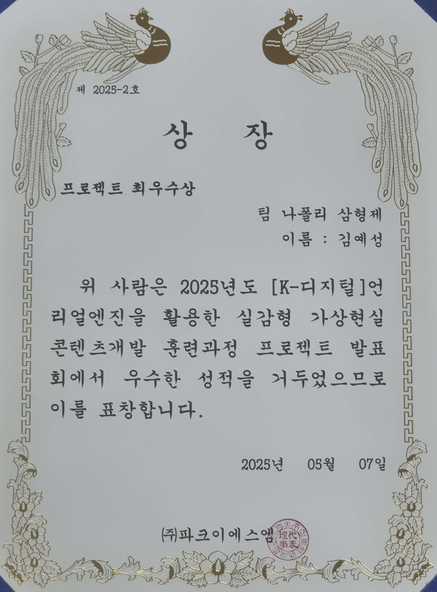
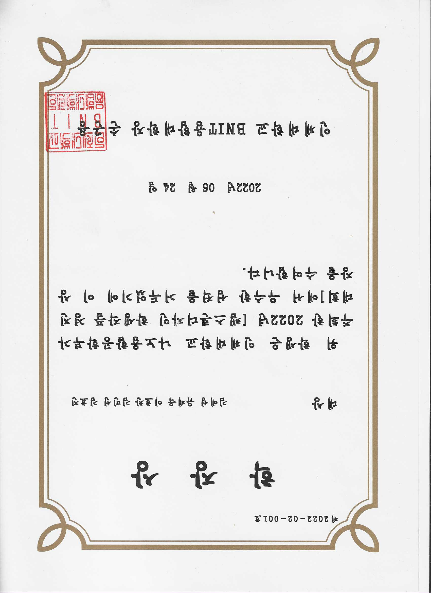
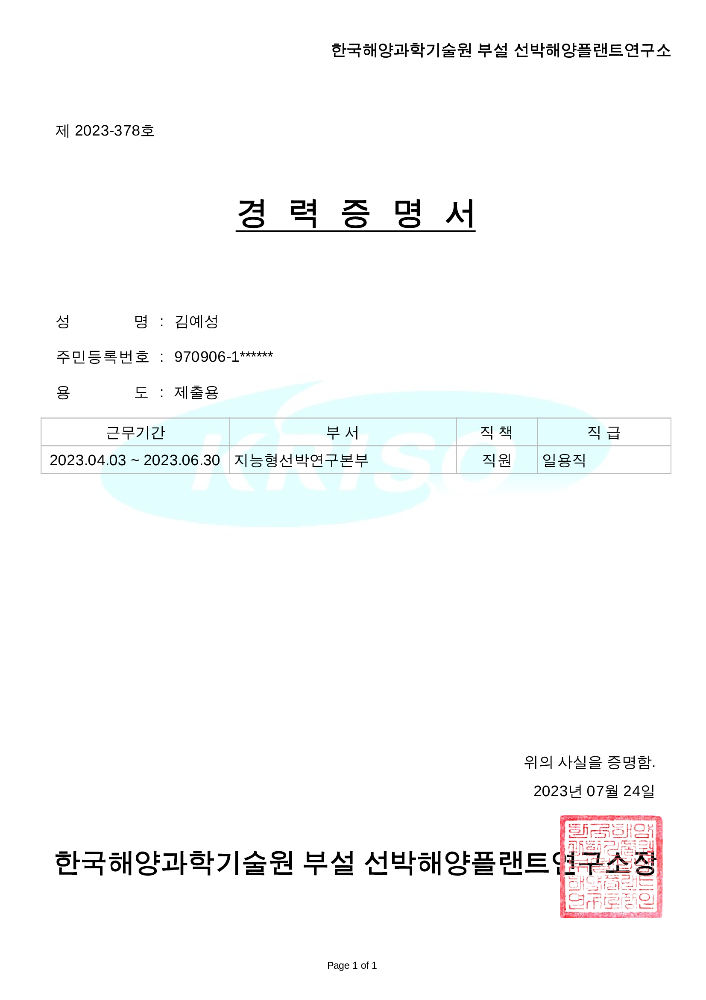
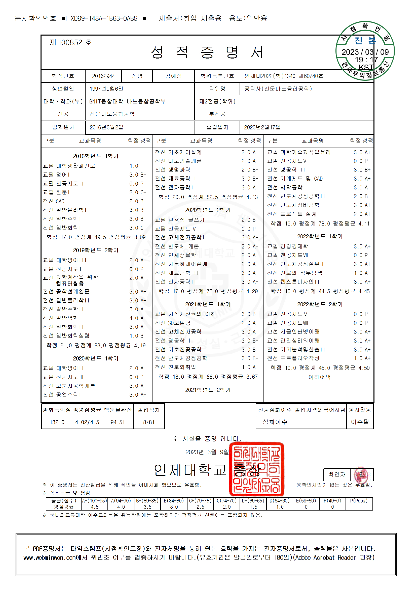
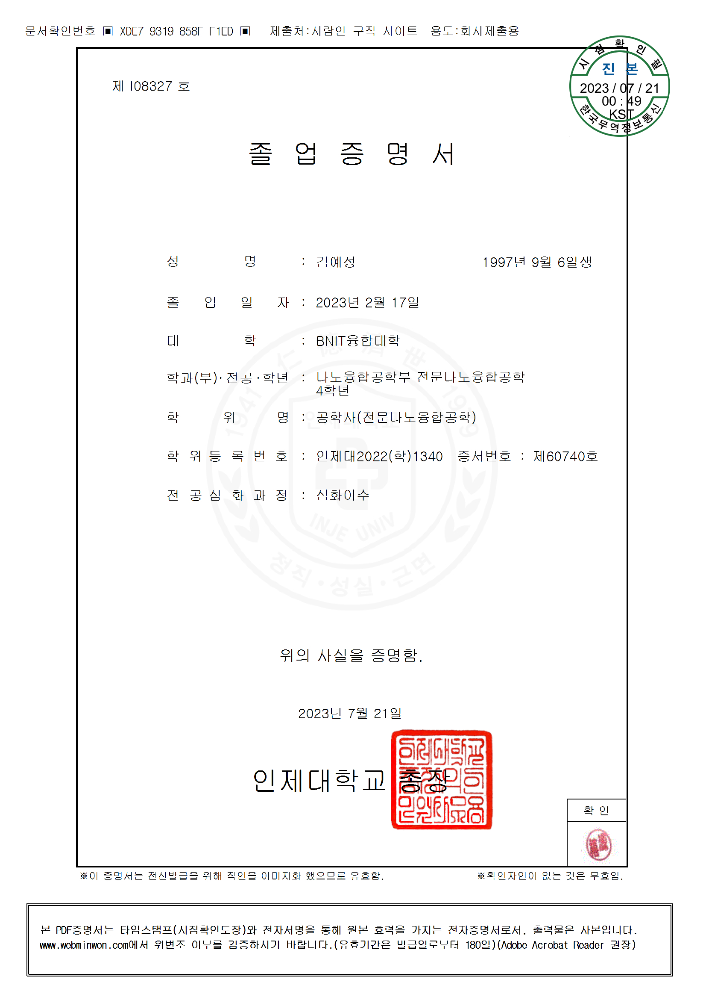

# KimYeSung_Certificate
## <개요>
수상 기록 및 증명서들을 한번에 볼 수 있도록 정리하였습니다.  

## 언리얼엔진 게임개발 최우수상
- 부산예일직업전문학교를 다닐 당시 언리얼엔진 게임개발 발표회에서 수상하였던 상 입니다.
- 발표회 당시 평가자로는 (주)파크이에스엠 의 이승찬 대표님이었습니다.
### [pdf 다운로드](./김예성_언리얼엔진_게임개발_최우수상.pdf)

## 캡스톤 디자인 대상
- 인제대학교 나노융합공학부에서 흔히 졸업작품이라 불리는 캡스톤 디자인 학생작품 경진대회에서 수상하였던 상입니다.
- 프로젝트로는 "자동차의 속도에 따른 과속방지턱 제어 및 전력충전"을 진행하였습니다.
- 자동차의 속도가 과속이면 과속방지턱의 역할을 하며, 과속이 아니라면 자동차가 과속방지턱을 눌러서 부드럽게 지나갈 수 있게 하였습니다.
또한 자동차가 과속방지턱을 누르는 힘으로 전력이 충전되어, 충전된 전력을 사용할 수 있게 하였습니다.
### [pdf 다운로드](./김예성_캡스톤디자인_대상.pdf)

## 선박해양플랜트연구소 경력증명서
- 2023년 선박해양플랜트연구소에서 계약직으로 근무했을 당시의 기록을 증명하는 경력증명서 입니다. 
- 주로 맡았던 업무로는 리눅스 운영체제에서 ROS2를 이용하여 실제로 운항하였던 선박 데이터의 bag파일에 있는 정보를 추출하고
선박 정보를 검색할 수 있는 사이트에서 검색하고 나온 정보들을 저장하는것을 자동화 하는 코딩을 하는 업무를 맡았습니다.
또한 bag파일의 누락된 선박 위치 정보를 계산하여 bag파일에 삽입하고 저장하는 것을 자동화 하는 코딩도 맡았습니다. 
### [pdf 다운로드](./김예성_경력증명서_선박해양플랜트연구소.pdf)

## 인제대학교 성적증명서
- 인제대학교를 졸업할 당시의 성적증명서입니다.
- 최종학점은 4.02 입니다.
### [pdf 다운로드](./김예성_성적증명서.pdf)

## 인제대학교 졸업증명서
- 인제대학교를 졸업하였음을 증명하는 졸업증명서입니다.
### [pdf 다운로드](./김예성_졸업증명서.pdf)

